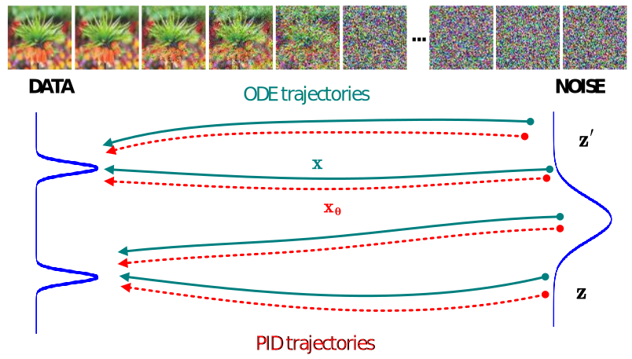
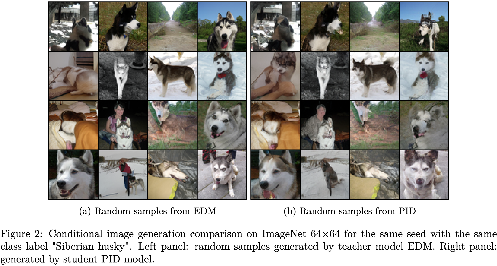

# Physics Informed Distillation for Diffusion Models

Diffusion models have recently emerged as a potent tool in generative modeling. However, their inherent iterative nature often results in sluggish image generation due to the requirement for multiple model evaluations. Recent progress has unveiled the intrinsic link between diffusion models and Probability Flow Ordinary Differential Equations (ODEs), thus enabling us to conceptualize diffusion models as ODE systems. Simultaneously, Physics Informed Neural Networks (PINNs) have substantiated their effectiveness in solving intricate differential equations through implicit modeling of their solutions. Building upon these foundational insights, we introduce Physics Informed Distillation (PID), which employs a student model to represent the solution of the ODE system corresponding to the teacher diffusion model, akin to the principles employed in PINNs. Through experiments on CIFAR 10 and ImageNet 64x64, we observe that PID achieves performance comparable to recent distillation methods. Notably, it demonstrates predictable trends concerning method-specific hyperparameters and eliminates the need for synthetic dataset generation during the distillation process. Both of which contribute to its easy-to-use nature as a distillation approach for Diffusion Models.

This repository is the official implementation of the paper: Physics Informed Distillation for Diffusion Models, accepted by Transactions on Machine Learning Research (TMLR).
This repository is based on [openai/consistency_models](https://github.com/openai/consistency_models). Our modifications have enabled support for PID training and sampling.



An overview of the proposed method, which involves training a model $\mathbf{x}_{\theta}(\mathbf{z}, \cdot )$ to approximate the true trajectory $\mathbf{x}(\mathbf{z}, \cdot )$.




# Environment Setup

To install all packages in this codebase along with their dependencies, run
```sh
conda create -n pid-diffusion python=3.9
conda activate pid-diffusion
conda install pytorch=1.13.1 torchvision=0.14.1 pytorch-cuda=11.6 -c pytorch -c nvidia
conda install -c "nvidia/label/cuda-11.6.1" libcusolver-dev
conda install mpi4py
git clone https://github.com/pantheon5100/pid_diffusion.git
cd pid_diffusion
pip install -e .
```

# Get Started

## Prepare Distillation Teacher
For CIFAR10 and ImageNet 64x64 experiments, we use the teacher model from [EDM](https://github.com/NVlabs/edm). The released checkpoint is a pickle file, so we need to extract the weights first. Run the official image sampling [code](https://github.com/NVlabs/edm/blob/main/generate.py) to save the model's state dict.

We provide the extracted checkpoints for direct use:
- [CIFAR10](https://drive.google.com/file/d/1UT72TxuDcJ6F54fsBgDZDVYix1sS8vKd/view?usp=sharing)
- [ImageNet64x64](https://drive.google.com/file/d/1sKFMEk48BHb7x7FJpPHsLxTGyIhgpCOm/view?usp=sharing)

Place the downloaded checkpoints into the './model_zoo' directory.

## Distillation with PID
To start the distillation, use the bash scripts:
```sh
bash ./scripts/distill_pid_diffusion.sh
```

We use Open MPI to launch our code. Before running the experiment, configure the following in the bash file:

> a. Set the environment variable `OPENAI_LOGDIR` to specify where the experiment data will be stored (e.g., `../experiment/EXP_NAME`, where `EXP_NAME` is the experiment name).
>
> b. Specify the number of GPUs to use (e.g., `-np 8` to use 8 GPUs).
> 
> c. Set the total batch size across all GPUs (e.g., `--global_batch_size 512`, which will result in a batch size of `512/8=64` per GPU).

## Image Sampling
Use the bash script `./scripts/image_sampling.sh` to sample images from the pre-trained teacher model or the distilled model. The distilled PID model can be downloaded [here](https://drive.google.com/drive/folders/1rOmGWPyfhaVr6nfbVzJ8Xruk2ePWu1XE?usp=sharing).

## FID Evaluation
To evaluate FID scores, use the provided bash script `./scripts/fid_eval.sh`, which will evaluate all checkpoints in the `EXP_PATH` folder. Download the reference statistics for the teacher model from [EDM](https://nvlabs-fi-cdn.nvidia.com/edm/fid-refs/) and place them in `./model_zoo/stats/cifar10-32x32.npz` and `./model_zoo/stats/imagenet-64x64.npz`. Run the following to download the reference statistics:
```sh
mkdir ./model_zoo/stats
wget https://nvlabs-fi-cdn.nvidia.com/edm/fid-refs/cifar10-32x32.npz -P ./model_zoo/stats
wget https://nvlabs-fi-cdn.nvidia.com/edm/fid-refs/imagenet-64x64.npz -o ./model_zoo/stats/imagenet-64x64.npz
```

To assess our pretrained [CIFAR10 model](https://drive.google.com/file/d/1uhJnW-vbdheHIMX2NyoqW921-f9VTuYI/view?usp=sharing), place it in `model_zoo/pid_cifar/pid_cifar.pt`, then execute the following for evaluation:
```
EXP_PATH="./model_zoo/pid_cifar"

mpirun -np 1 python ./scripts/fid_evaluation.py \
    --training_mode one_shot_pinn_edm_edm_one_shot \
    --fid_dataset cifar10 \
    --exp_dir $EXP_PATH\
    --batch_size 125 \
    --sigma_max 80 \
    --sigma_min 0.002 \
    --s_churn 0 \
    --steps 35 \
    --sampler oneshot \
    --attention_resolutions "2"  \
    --class_cond False \
    --dropout 0.0 \
    --image_size 32 \
    --num_channels 128 \
    --num_res_blocks 4 \
    --num_samples 50000 \
    --resblock_updown True \
    --use_fp16 False \
    --use_scale_shift_norm True \
    --weight_schedule uniform \
    --seed 0
```
